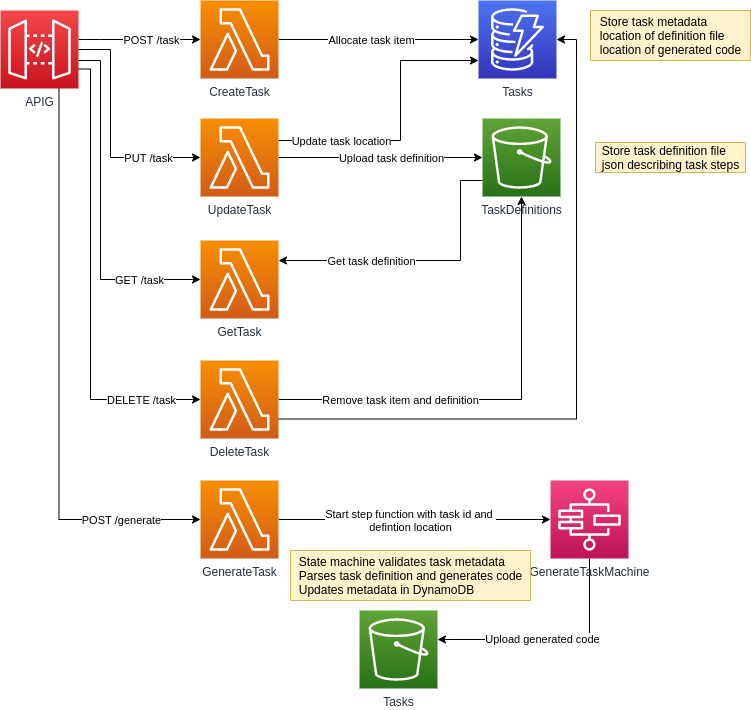

API to manage json defined "Task" definitions and generate code from them.

Uses API Gateway and DynamoDB/S3 to store Task metadata and definition files.

Uses StepFunctions to validate and generate Task code from definitions.




JSON is used to define the Tasks with a series of Steps.

```json
{
  "name": "Example Task",
  "steps": [
    {
      "type": "comment",
      "value": "This is a comment and won't be evaluated"
    },
    {
      "type": "variable",
      "name": "x",
      "value": 10
    },
    {
      "type": "variable",
      "name": "y",
      "value": 3
    },
    {
      "type": "calc",
      "output": "z",
      "expression": "x + y"
    },
    {
      "type": "print",
      "input": ["x", "'plus'", "y", "'equals'", "z"]
    }
  ]
}
```

Each step is converted to corresponding python.

```python
# This is a comment and won't be evaluated

x = 10

y = 3

z = x + y

print(x, 'plus', y, 'equals', z)
```